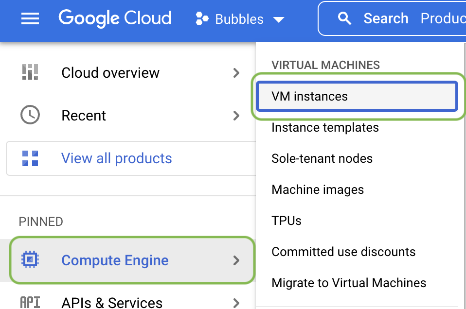
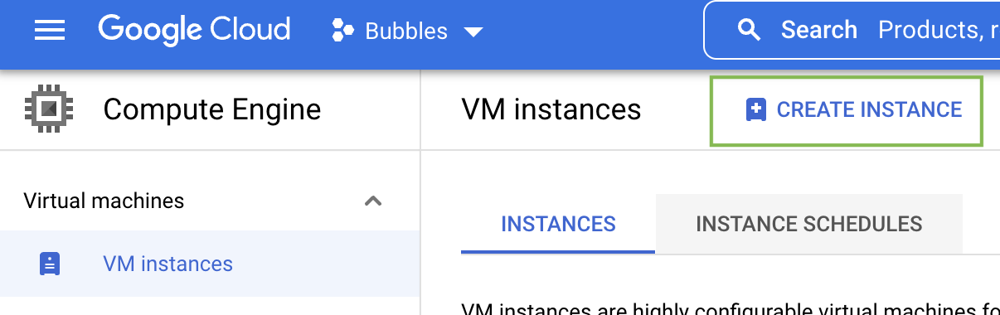
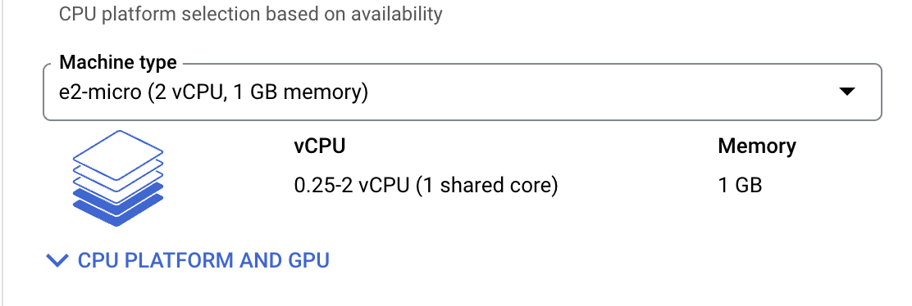
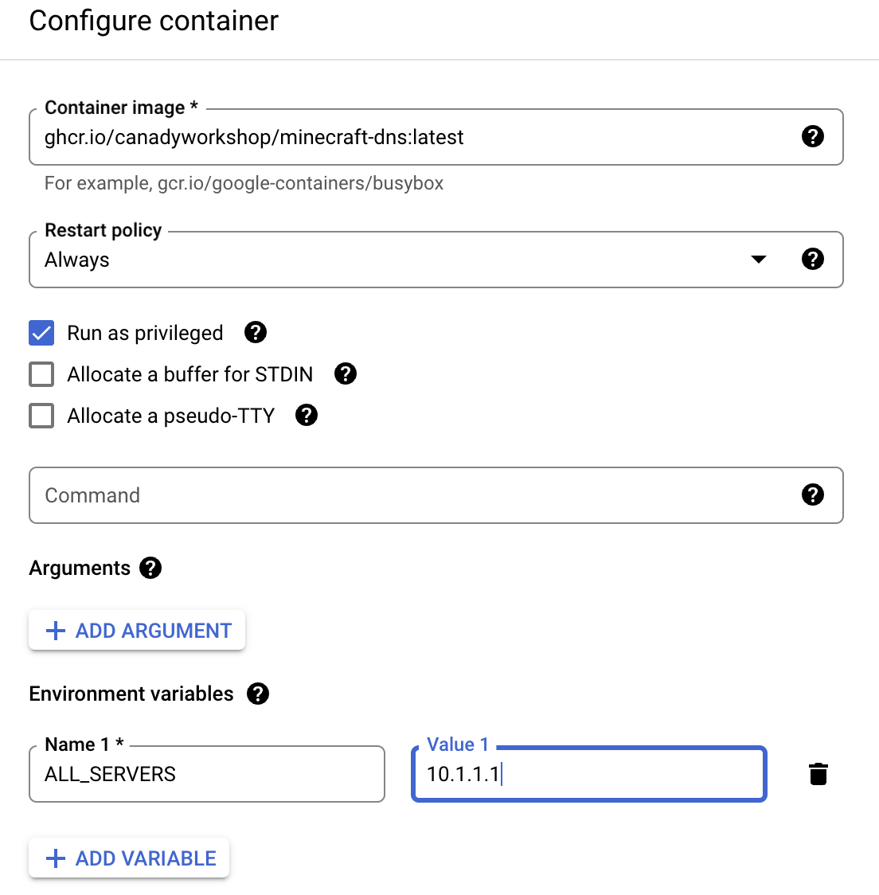
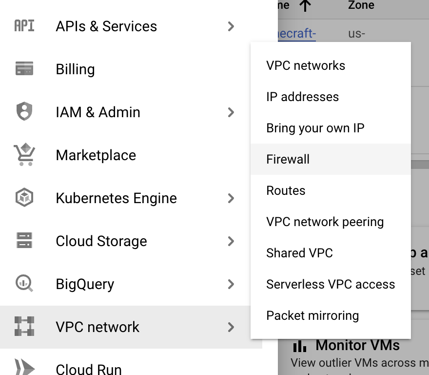
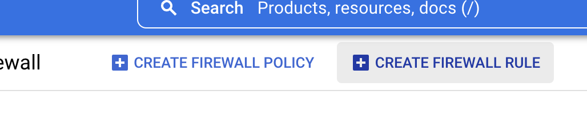
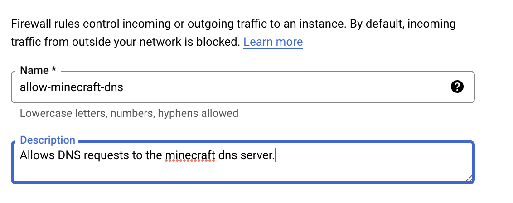
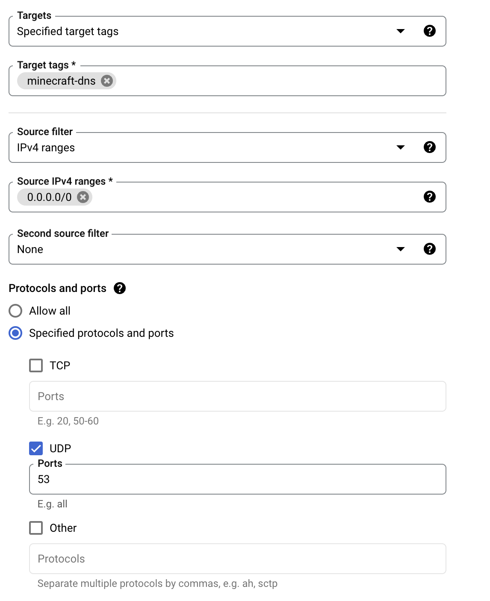
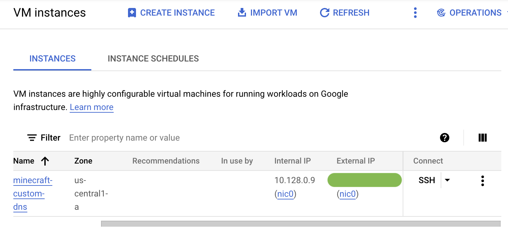

# canadyworkshop/minecraft-dns

The minecraft-dns image provides a DNS server that optionally replaces the DNS entries for the "featured" servers of Minecraft Bedrock. This allows consoles such as the Nintendo Switch to connect to customer servers by configuring the Switch to use this DNS server for name resolution.

## Usage

1. Deploy minecraft-dns image using one of many container services. (Docker, K3s, K8s, containerd, etc)
    - Specify which "featured" servers to replace with custom server IP address using enviornmental variables.
2. Configure the consoles network configuration to use the IP of the container for DNS resolution.
3. Connect to the "featured" server in Minecraft that was replaced. The name should reflect your customer server.

## Configuration Options

**NOTE:** If ALL_SERVERS is provided all others are ignored. 

|Server|Env|Notes|
|-------|----|-----|
|All|ALL_SERVERS|Sets all the servers to the IP provided. Setting this will ignore all server specific environmental variables.
Galaxite|GALAXITE|Sets the DNS for Galaxite to the IP this env is set to.
Pixel Paradise|PIXEL_PARADISE|Sets the DNS for Pixel Paradise to the IP this env is set to.
Lifeboat|LIEFBOAT|Sets the DNS for Mineplex to the IP this env is set to.
Cube Craft|CUBECRAFT|Sets the DNS for CubeCraft to the IP this env is set to.
The Hive|THE_HIVE|Sets the DNS for TheHive to the IP this env is set to.
Mineville|MINEVILLE|Sets the DNS for Mineville to the IP this env is set to.

### Docker

Using docker on a local machine is the simplest way to run it for local networks. 

```
docker run -p 53:53/udp --env=ALL_SERVERS='xxx.xxx.xxx.xxx' hcr.io/canadyworkshop/minecraft-dns:latest
```

### GCP (Using Compute Engine)

Using GCP is an easy way to run on the public internet. GCP offer a free teir for their compute engine that can be used to operate this DNS server at no cost. 

**NOTE:** The free teir only allows a single compute engine instance. If you are already using the instance a second will not be free. 

## Deploy on GCP

This section provides details on how to deploy onto the GCP free tier. This is not the only way but the simplest way for someone new to GCP.

1. Create a [GCP account](https://cloud.google.com/). 
2. Select the default project. 
3. Navigate to the Compute Engine -> VM instances 
4. Click Create Instance 
5. Provide a reasonable name for the instance such as minecraft-custom-dns.
6. Make sure to select the [correct machine type for the free tier](https://cloud.google.com/free?utm_source=google&utm_medium=cpc&utm_campaign=na-US-all-en-dr-bkws-all-all-trial-e-dr-1011347&utm_content=text-ad-none-any-DEV_c-CRE_518216250706-ADGP_Desk%20%7C%20BKWS%20-%20EXA%20%7C%20Txt%20~%20GCP%20~%20Pricing_Pricing_Free-KWID_43700061498279726-kwd-310728589823&utm_term=KW_gcp%20free%20tier-ST_gcp%20free%20tier&gclid=Cj0KCQiAtbqdBhDvARIsAGYnXBMctZa3DylKhesdYb_KAWSzqCaQbWrmJix_ssMEf_QSzAL2MRVUrhEaAmT0EALw_wcB&gclsrc=aw.ds). 
7. Click the Deploy Container button. This will configure the Compute Engine instance to run the container on startup.
8. Configure the container to use the proper image and set the variables as needed for your config.
9. Expand the networking section and add a new tag named minecraft-dns. This tag will later be used to allow DNS queries to the instance across the GCP firewall.
10. Click create.
11. Navigate to the VPC Firewall section. 
12. Click Create Firewall Rule 
13. Provide a reasonable name for the rule. 
14. Configure the rule.
    - Targets: Specified target tags.
    - Target tags: Add the same tag you used on the instance.
    - Set the source IPv4 range to 0.0.0.0/0 to allow everything. Optionally limit if you would like.
    - Click Specified protcols and ports
    - Check UDP
    - Add port 53 
15. Create rule.
16. Lookup external IP address of VM. This is the IP that should be configured on the consoles for DNS. By defaul the address is emphermal meaning it will change if the VM is restarted. You may reserve the IP to prevent it changing but there will be a charge. 
